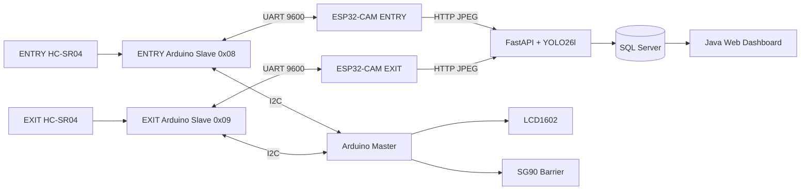

# Smart Parking System with Vehicle Detection and Barrier Control

An IoT-based smart parking prototype that combines ultrasonic sensing, ESP32-CAM image capture, server-side YOLO26l vehicle detection, Arduino-based barrier control, SQL Server logging, and a Java web dashboard.

## Project Overview

The system detects an object near the parking gate using an HC-SR04 ultrasonic sensor. When an object is detected, the corresponding ESP32-CAM captures an image and sends it to a FastAPI server. YOLO26l checks whether the image contains an allowed vehicle class. The result is returned as `OPEN` or `CLOSE`, and the Arduino Master controls the SG90 barrier.

The project follows a fail-close rule: any camera, Wi-Fi, server, timeout, or communication error keeps the barrier closed.

## Main Features

- ENTRY and EXIT vehicle-detection modules
- HC-SR04 ultrasonic object detection
- ESP32-CAM JPEG image capture
- FastAPI backend
- YOLO26l server-side vehicle detection
- Arduino Uno Master-Slave architecture
- I2C communication between Master and Slaves
- UART communication between Slave and ESP32-CAM
- SG90 servo barrier control
- LCD1602 local debugging display
- SQL Server event storage
- Java Servlet/JSP monitoring dashboard
- Raw and annotated image storage

## System Architecture



## Workflow

```text
HC-SR04 detects an object
→ Arduino Slave reports the event
→ Arduino Master starts a capture cycle
→ Slave sends CAPTURE to ESP32-CAM
→ ESP32-CAM uploads a JPEG image
→ FastAPI runs YOLO26l
→ Server returns OPEN or CLOSE
→ Result returns to the Arduino Master
→ Master controls the SG90 barrier
```

## Hardware

| Component | Quantity |
|---|---:|
| Arduino Uno R3 Master | 1 |
| Arduino Uno R3 Slave | 2 |
| HC-SR04 ultrasonic sensor | 2 |
| ESP32-CAM | 2 |
| SG90 servo motor | 1 |
| LCD1602 | 1 |
| Regulated 5 V power supply | 1 |

### Direction Mapping

| Direction | I2C Address | ESP32-CAM Module | Gate ID |
|---|---:|---|---:|
| ENTRY | `0x08` | `ENTRY` | 1 |
| EXIT | `0x09` | `EXIT` | 2 |

## Communication

| Connection | Protocol |
|---|---|
| Arduino Master ↔ Slaves | I2C |
| Arduino Slave ↔ ESP32-CAM | UART at 9600 baud |
| ESP32-CAM ↔ FastAPI | HTTP over Wi-Fi |
| FastAPI ↔ SQL Server | Database connection |
| Arduino Master → SG90 | PWM |
| Arduino Master → LCD1602 | 4-bit parallel interface |

## Technology Stack

### Embedded

- Arduino Uno R3
- ESP32-CAM
- HC-SR04
- SG90
- Arduino C/C++

### Backend and AI

- Python
- FastAPI
- Uvicorn
- Ultralytics YOLO
- YOLO26l
- OpenCV

### Database

- Microsoft SQL Server

### Web Dashboard

- Java Servlet
- JSP
- JSTL
- DAO pattern
- Apache Tomcat

## Repository Structure

```text
.
├── Arduino/
│   ├── Master/
│   │   └── Master.ino
│   ├── Slave/
│   │   └── Slave.ino
│   └── ESP32-CAM/
│       └── ESP32_CAM.ino
├── SmartParkingYOLO/
│   ├── YoloSERVER.py
│   ├── requirements.txt
│   ├── yolo26l.pt
│   └── parking-image/
│       ├── raw/
│       └── results/
│           └── annotated/
├── WebDemo/
└── README.md
```

Adjust the structure above if the repository uses different folder names.

## Setup

### 1. FastAPI Server

Create a virtual environment:

```bash
python -m venv .venv
```

Activate it on Windows:

```powershell
.venv\Scripts\activate
```

Install dependencies:

```bash
pip install -r requirements.txt
```

Start the server:

```bash
uvicorn YoloSERVER:app --host 0.0.0.0 --port 8000
```

Place `yolo26l.pt` in the path expected by `YoloSERVER.py`.

### 2. ESP32-CAM Configuration

Configure each camera with:

```text
Wi-Fi SSID
Wi-Fi password
FastAPI server URL
Module name: ENTRY or EXIT
```

Example server URL:

```text
http://192.168.x.x:8000
```

Final camera configuration:

```cpp
config.xclk_freq_hz = 20000000;
config.frame_size = FRAMESIZE_VGA;
config.jpeg_quality = 12;
config.fb_count = 1;
```

### 3. Arduino Configuration

Use the fixed I2C mapping:

```cpp
ENTRY_SLAVE_ADDRESS = 0x08;
EXIT_SLAVE_ADDRESS  = 0x09;
```

The Arduino Master must be the only module connected to the SG90 control signal.

### 4. SQL Server

Create the `SmartParkingIOT102` database and configure the connection strings used by the Python backend and Java web application.

Core tables:

```text
parking_occupancy
gates
detection_events
```

### 5. Java Dashboard

Deploy the Java web application to Tomcat and open:

```text
http://localhost:<port>/<context-path>/dashboard
```

## API

### Detect Vehicle

```http
POST /detect?module=ENTRY
Content-Type: image/jpeg
```

or:

```http
POST /detect?module=EXIT
Content-Type: image/jpeg
```

Response:

```text
OPEN
```

or:

```text
CLOSE
```

YOLO configuration:

| Parameter | Value |
|---|---|
| Model | `yolo26l.pt` |
| Image size | 640 |
| Confidence threshold | 0.45 |
| Allowed classes | car, motorcycle, bus, truck |

## Experimental Results

The final YOLO26l experiment used 146 real ESP32-CAM images of physical vehicle models.

| Metric | Result |
|---|---:|
| Total images | 146 |
| `OPEN` decisions | 66 |
| `CLOSE` decisions | 80 |
| Positive-sample detection rate | 45.21% |
| Miss rate | 54.79% |
| Average inference time | 432.23 ms |
| Median inference time | 415.76 ms |
| Maximum inference time | 837.82 ms |

Accepted detections:

| Class | Count |
|---|---:|
| Truck | 43 |
| Car | 23 |

The dataset contained only positive vehicle images. Therefore, 45.21% is a positive-sample detection rate, not complete model accuracy.

## Current Limitations

- The evaluation dataset contains no verified negative samples.
- End-to-end gate response time was not measured.
- The complete hardware workflow was not repeated for all 146 image requests.
- The Master stops normal operation when either Slave is inactive.
- ESP32-CAM operation requires a stable regulated 5 V supply.
- Dashboard and database reliability were not fully quantified.
- License plate recognition is not implemented.
- The prototype uses physical vehicle models and an SG90 servo.
- The system is not intended for production deployment.

## Future Improvements

- Add positive and negative labeled datasets
- Fine-tune YOLO using local ESP32-CAM images
- Add synchronized timestamps across all modules
- Measure complete sensor-to-barrier response time
- Add independent ENTRY and EXIT fault handling
- Add Master-to-backend telemetry
- Improve power distribution
- Add dashboard validation tests
- Add license plate recognition as a separate future module
- Replace the SG90 with production-grade barrier hardware

## Team

- Nguyen Sy Minh Man
- Do Thanh Triet
- Tran Dang Khoa
- Bui Dinh Long

FPT University, Ho Chi Minh Campus, Vietnam

## Academic Notice

This repository contains a laboratory proof-of-concept developed for the IOT102 course. It must not be used as a production vehicle-access or safety-control system without further testing and engineering validation.